<div align="center">



<br/>


<br/>


</div>

---

## `> SYSTEM.USER`

```json
{
  "name": "João Pedro Santana",
  "role": "Full Stack Developer",
  "education": "Software Engineering",
  "location": "Brazil",
  "focus": [
    "Web Development",
    "Business Systems",
    "Automation",
    "Software Architecture"
  ],
  "status": "Always learning..."
}
```

---

## `> ABOUT_ME`

```text
joao@developer:~$ whoami
```

Sou estudante de **Engenharia de Software** e desenvolvedor **Full Stack**, apaixonado por tecnologia e pela construção de soluções para problemas reais.

Meu foco está no desenvolvimento de **sistemas web completos**, trabalhando com interfaces, APIs, bancos de dados, regras de negócio, autenticação, automação e infraestrutura.

```text
> Learning ................. ████████████████████ 100%
> Building ................. ███████████████████░  95%
> Improving ................ ████████████████████ 100%

SYSTEM STATUS: ONLINE ●
```

---

## `> TECH_STACK`

<div align="center">

### FRONT-END


### BACK-END


### DATABASE


### TOOLS & INFRASTRUCTURE


</div>

---

## `> FEATURED_PROJECTS`

<table>
<tr>
<td width="50%">

### 📊 Gestor360

Sistema de gestão empresarial desenvolvido para centralizar informações, indicadores e processos.

`React` `TypeScript` `Node.js` `MySQL`

</td>

<td width="50%">

### 💰 Financeiro360

Sistema financeiro para gerenciamento de vendas, comissionamentos, conferências e processos financeiros.

`React` `TypeScript` `Node.js` `MySQL` `Docker`

</td>
</tr>

<tr>
<td width="50%">

### 🏠 A Casa

Plataforma web desenvolvida com foco em experiência digital e gerenciamento de funcionalidades.

`React` `TypeScript` `Node.js` `MySQL`

</td>

<td width="50%">

### ⚡ NEXT_PROJECT.exe

```text
STATUS.............. PLANNING
ARCHITECTURE........ LOADING
DATABASE............ LOADING
CODE................ SOON
```

</td>
</tr>
</table>

---

## `> CURRENT_MISSIONS`

```text
[01] Full Stack Development      ██████████████████░░ 90%
[02] Software Architecture       ██████████████░░░░░░ 70%
[03] Production Systems          █████████████████░░░ 85%
[04] Artificial Intelligence     ████████████░░░░░░░░ 60%
[05] Process Automation          ████████████████░░░░ 80%

> Mission: Build solutions that make a difference.
```

---

## `> GITHUB_ANALYTICS`

<div align="center">


</div>

---

## `> ACTIVITY`

<div align="center">


</div>

---

## `> CONTRIBUTION_MATRIX`

<div align="center">

<picture>
  <source media="(prefers-color-scheme: dark)"
    srcset="https://raw.githubusercontent.com/jpcsantana001/jpcsantana001/output/github-contribution-grid-snake-dark.svg">

<source media="(prefers-color-scheme: light)"
 srcset="https://raw.githubusercontent.com/jpcsantana001/jpcsantana001/output/github-contribution-grid-snake.svg">

 </picture>

</div>

---

## `> CONNECT`

<div align="center">

<a href="https://www.linkedin.com/in/joão-pedro-santana-dos-anjos-016b10312">

</a>

<a href="https://www.instagram.com/joaop__santana">

</a>

<a href="https://github.com/jpcsantana001">

</a>

</div>

---

<div align="center">

```text
╔══════════════════════════════════════════════╗
║                                              ║
║           SYSTEM STATUS: ONLINE              ║
║                                              ║
║     Building • Learning • Improving          ║
║                                              ║
╚══════════════════════════════════════════════╝
```

### `< João Pedro Santana />`


</div>
